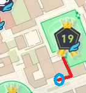
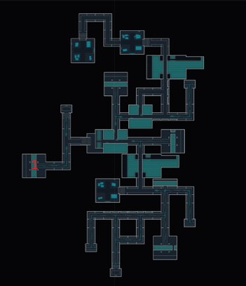

Pokémon Legends ZA automation
===============================

**Note:** This is designed for the switch 2. If you want to use this on the switch 1, you will need to set up the arduino with the initialization methods found in [VinDuv's original repo](https://github.com/VinDuv/switch-arduino-controller) and adjust timing to be about tripple for loading zones and animations. A

**Note:** My shiny dex is completed in this game so untill DLC comes out unless anyone reaches out, I likely wont be adding any more features for now!

This module automates shiny rolling in legends ZA.

Requirements
------------

You will need an Arduino UNO R3, an external Arduino programmer, and a
pushbutton inserted in the Arduino board, between pins 13 and GND (on the top
row).

You can additionally install a buzzer between pins 2 and GND.

See [the main README](../../README.md#required-hardware) for details.

Installation
------------

Use `make` to build the `usb-iface.hex` and `za.hex` files. Flash
`usb-iface.hex` to the USB interface microcontroller (ATmega16U2), and
`za.hex` to the main microcontroller (ATmega328P).

See the main README for the
[required software](../../README.md#required-software), the
[build procedure](../../README.md#building), and the
[programming procedure](../../README.md#programming).

Usage
-----

Plug the Arduino to the Switch; the L LED on the Arduino board should start
blinking rapidly, and the TX/RX LEDs should be off.

To start the automation process, start Pokémon Sword/Shield (if it is not
already), and put the game in the required state (which depends on the task to
be automated; see below for details).

Press Home to get to the Switch main menu (the selection should be on
the game icon) and press the pushbutton on the Arduino board. The emulated
controller will get auto-registered as controller 2.

Once it’s ready, the Arduino L LED will blink once per second, and both the
RX and TX LEDs will be lit up. You are in the “main menu”, which allows you
to select which automation feature to perform. Press the pushbutton on the
board once to activate feature 1; twice to activate feature 2; etc.

The different automation features are described below.

## Reroll wild area [Feature 1 — one button press]

**Pre-requisites:** Warp to the wild area you will be working rerolling via its main icon.

Sub menu one:
Select your grouping of areas (see table)

Sub menu two: Select your area (see table)

|Presses in sub menu 1 | Presses in sub menu 2 | Resulting Zone |
| --- | --- | --- |
| 1	| 1	|1|
| 1	| 2	|2|
| 1	| 3	|3|
| 1	| 4	|4|
| 1	| 5	|5|
| 2	| 1	|6*|
| 2	| 2	|7|
| 2	| 3	|8|
| 2	| 4	|9|
| 2	| 5	|10|
| 3	| 1	|11|
| 3	| 2	|12|
| 3	| 3	|13|
| 3	| 4	|14|
| 3	| 5	|15|
| 4	| 1	|16|
| 4	| 2	|17|
| 4	| 3	|18|
| 4	| 4	|19|
| 4	| 5	|20|

**Note** Zone 6 requies Cafe Bataille to be accessable. The reroll will drop you there to increase spawn radius after the intial set up and orientation.

## Tower Rerolling [Feature 2 - two button presses]

**Pre-requisites:** Be at the top of the tower in area 3, directly after exiting the stairs up, facing away from the zone 

## Teleporter Rerolling [Feature 3 - three button presses]

**Pre-requisites:** Stand on a teleporter pad in Lysandre Labs

## Bench Resetting [Feature 4 - four button presses]

**Pre-requisites:** Have "Sit" dialog on screen in front of a bench

## Individual Resetting [Feature 5 - five button presses]

Sub menu one:
Select your pokemon (see table)
| Presses | Pokemon | Prereq |
| --- | --- | --- |
| 1 | Honedge | Go through the first teleporter pad in Lysandre Labs directly in front of the elevator at the enterance.|
| 2 | Drampa | At night, go to the far side of the area 19 flypoint and exit through that side. Turn left, go up the stairs, at the top take a right and walk about 30 m forward. There will be 2 benches on your right. Face the bench closest to the road so that the "Sit here" dialog is showing. See map below.|
| 3 | Helioptile | Warp to area 14 |

**Drampa Map**:  
 

## Sewer Resetting [Feature 6 - six button presses]

**Pre-requisites:** Go through the first teleporter pad in Lysandre Labs directly in front of the elevator at the enterance.

This command will run far enough into the room with Doublade and two Honedge to reroll them, then return to the teleporter pad and reset the process.

Sub menu one:
Select Sewer endpoint - see image

**Pre-requisites:** Anywhere in sewer, out of combat, no map up.  
   

|Presses in sub menu 1 | Resulting Zone | Respawned Pokemon|
| --- | --- | --- |
| 1	| 1	| Goomy (1), Inkay (2) |
| 2	| 2	| Litwick (2), Patrat (3) |

## Reroll Hyperspace [Feature 7 - Seven button presses]

**Pre-requisites:** Be out of combat in hyperspace with pokemon inside of the 50 unit radius.

Warps back to the portal over and over as quickly as possible.

## Area 20 Alpha Spawning Glitch [Feature 8 - Eight button presses]

### Only works pre 2.0 patch ###

**Pre-requisites:** See [This Video](https://youtube.com/shorts/wpKpsWk2kq4?si=TfAEQC8_qQXp36tq) for setup, then go the bench between the pokemon center north of area 20 and the tower. Face the bench with the prompt for sitting on screen.

Bench reset but runs to the right 10 units to grab the far alphas, allowing for 6 to be reset at once instead of 4. Can also be used for bench resets here without the glitch for rerolling 2 alphas at a time.